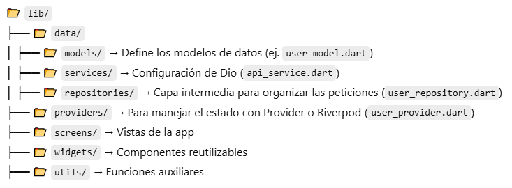

# DAM - Proyecto final DI y AD
El siguiente repositorio contiene en una versión demo del proyecto final para el alumnado de DAM que tendrán que crear una interfaz de usuario con la tecnología Flutter/Dart que conecta al backend con lenguaje Java y Springboot.


# Requisitos previos FE(Frontend)
* Flutter: Instalación SDK Flutter y configuración del path en las variables de entorno

# Requisitos previos BE_API (Backend)
* Java:  Instalación JDK compatible con la solución (min JDK 17)
* MySQL: Instalación MySQL Server y Workbench (IMPORTANTE: Hay que crear el esquema 'sga')
  
# Configuración IDE VSCode
Es muy recomendable agregar los siguientes plugins en VSCode para trabajar en ambos proyectos:
* C/C++ Extension Pack
* Extension Pack for Java
* Flutter

A continuación, se dispone de un ejemplo de configuración para poder realizar debug en el equipo local:
   ```settings.json
{
    "version": "0.2.0",
    "configurations": [
        {
            "type": "java",
            "name": "Launch Current File",
            "request": "launch",
            "mainClass": "${file}"
        },
        {
            "name": "FE (Flutter Chrome)",
            "program": "lib/main.dart",
            "cwd": "FE",
            "deviceId": "chrome",
            "request": "launch",
            "type": "dart"
        }
    ]
}
   ```

# Arquitectura de la solución 
Pendiente de implementar (representación Flutter/Dart + API Spring WEB + ORM Hibernate + MySQL)
## Flutter
Para manejar múltiples controladores con distintos tipos de peticiones, se va a utilizar usar Dio + Repository Pattern + Provider



De esta manera va a ser más eficiente la gestión del flujo REST y, una vez comprendida la estructura, simplificará la implementación de nuevos elementos.


  
# Despliegue contenedores (Docker)
Se ha implementado una versión muy básica de docker-compose para que el alumnado pueda realizar una prueba de despliegue local y experimente con comandos de docker cómo ejecutar 3 procesos (FE+BE_API+MySQL)
